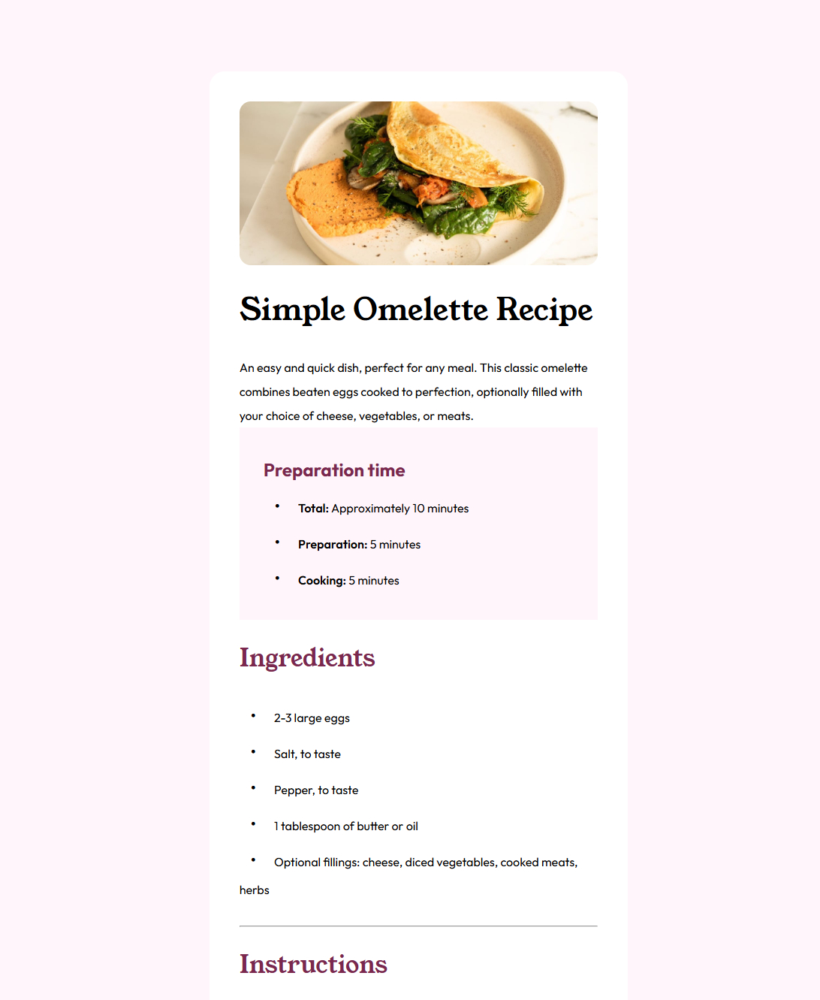

# Frontend Mentor - Recipe page solution

This is a solution to the [Recipe page challenge on Frontend Mentor](https://www.frontendmentor.io/challenges/recipe-page-KiTsR8QQKm).  

## Table of contents

- [Overview](#overview)
  - [The challenge](#the-challenge)
  - [Screenshot](#screenshot)
  - [Links](#links)
- [My process](#my-process)
  - [Built with](#built-with) 
- [Author](#author)
- [Acknowledgments](#acknowledgments)
 

## Overview

### Screenshot

 

### Links

- Solution URL: [Github](https://github.com/KenawMarie/front-recipe-page)
- Live Site URL: [live site](https://kenawmarie.github.io/front-recipe-page/)

## My process

### Built with

- Semantic HTML5 markup
- different CSS properties
- Flexbox 
 
 

## Author

- Website - [Kenaw M<arie](https://github.com/KenawMarie)
- Frontend Mentor - [@KenawMarie](https://www.frontendmentor.io/profile/KenawMarie)
 
 

## Acknowledgments

my acknowledgement goes to frontend mentor for this challenge.
